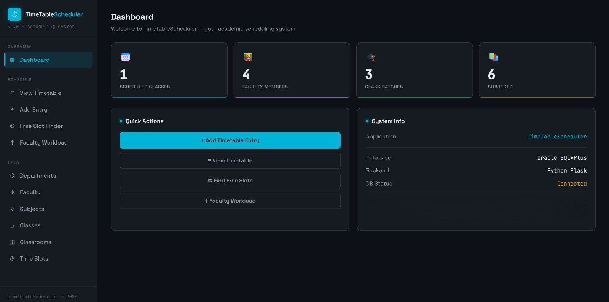
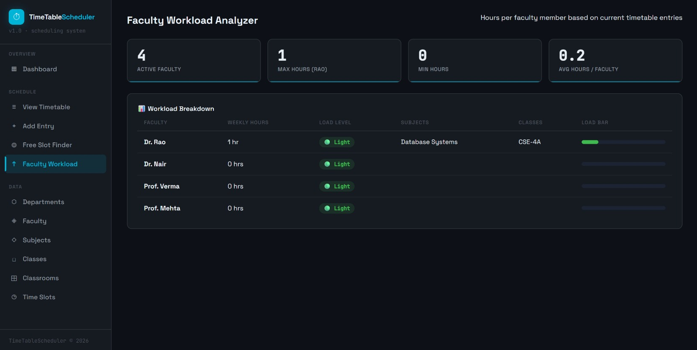
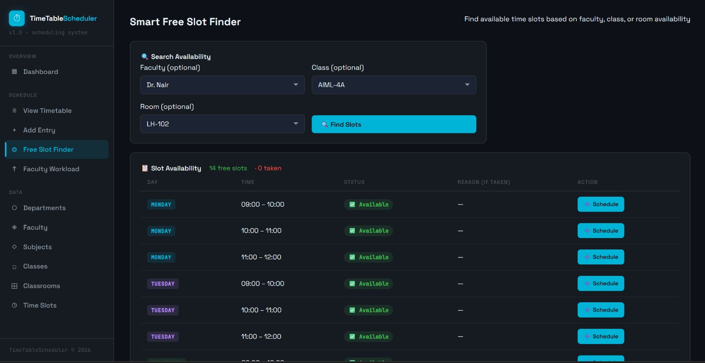

# Schedulix

A database-driven timetable scheduling and management system developed using Flask and Oracle SQL for handling academic scheduling workflows.

The system supports timetable management, conflict detection, free slot discovery, and faculty workload analysis through an interactive dashboard interface.

---

## Features

* Timetable scheduling management
* Conflict detection for overlapping schedules
* Free slot finder
* Faculty workload analysis
* Department and classroom management
* Subject and batch scheduling
* Interactive dashboard analytics

---

## Tech Stack

### Backend

* Python Flask

### Database

* Oracle SQL Plus

### Frontend

* HTML
* CSS
* JavaScript

---

## Screenshots

### Dashboard



---

### Faculty workload analyser



---

### Free Slot Finder



---

## Project Structure

```text
schedulix/
│
├── app/
│   ├── app.py
│
├── templates/
│   ├── dashboard.html
│   ├── timetable.html
│   ├── add_entry.html
│   ├── freeslots.html
│   ├── workload.html
│   ├── departments.html
│   ├── faculty.html
│   ├── subjects.html
│   ├── classrooms.html
│   └── timeslots.html
│
├── database/
│   └── setup_db.sql
│
├── screenshots/
│   ├── dashboard.jpeg
│   ├── workload_analyser.jpeg
│   └── slot_finder.jpeg
│
├── requirements.txt
└── README.md

```

---

## Core Modules

### Timetable Scheduling

Manage timetable entries across departments, faculty, classrooms, and time slots.

### Conflict Detection

Detect overlapping schedules and invalid timetable allocations.

### Free Slot Finder

Search available timetable slots for scheduling optimization.

### Faculty Workload Analysis

Analyze scheduled classes and faculty workload distribution.

---


## Challenges Faced

* handling timetable conflicts
* designing relational database schema
* implementing slot lookup logic
* managing timetable dependencies across entities
* synchronizing dashboard analytics with database updates

---

## Learning Outcomes

This project strengthened my understanding of:

* Flask backend development
* relational database design
* scheduling system logic
* conflict detection workflows
* dashboard-oriented web applications
* SQL-driven application architecture
